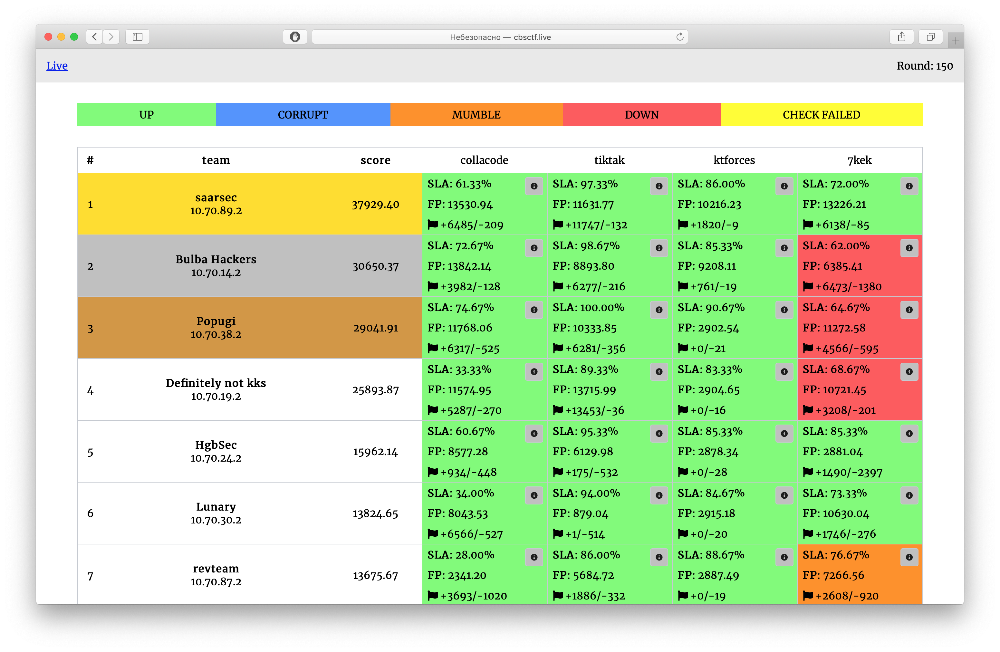

[](https://travis-ci.com/pomo-mondreganto/ForcAD)

# ForcAD



Pure-python distributable Attack-Defence CTF platform, created to be easily set up.

The name is pronounced as "forkád".

## Running

5 easy steps to start a game (assuming current working directory to be the project root): 

1.  Open `backend/config/config.yml` file 
(or copy `backend/config/config.yml.example` to `backend/config/config.yml`, if the latter is missing).

2.  Add teams and tasks to corresponding config sections following the example's format, 
set `start_time`, `timezone` (e.g. `Europe/Moscow`) and `round_time` (in seconds) (for recommendations see 
[checker_timeout](#checkers) variable).

3.  **Change default passwords** (that includes `storages.db.password`, `storages.redis.password`, 
`storages.rabbitmq.password` for database and cache, 
`admin.password` for `celery` visualization, which contains flags).

4.  Install `requirements.txt` (`pip3 install -r requirements.txt`) and run `./control.py setup` 
to transfer config variables

5.  Run `./control.py start --fast` to start the system. 
Wait patiently for the images to build, it could take a few minutes, but happens only once.
Notice that `--fast` option uses the pre-built image, so if you modified the source code, omit this option to 
run the full build.  

That's all! Now you should be able to access the scoreboard at `http://0.0.0.0:8080/`. Admin panel is accessible at 
`http://0.0.0.0:8080/admin`.

> Before each new game run `./control.py reset` to delete old database and temporary files (and docker networks)

## Configuration and usage

Teams are identified by unique randomly generated on startup tokens (look for them in the logs of `initializer` 
container or print using the following command after the system started: `./control.py print_tokens`).
 
You can either share all tokens with all teams (as submitting flags for other teams is not really profitable), 
or send tokens privately. Tokens have one upside: all requests can be masqueraded.

Platform consists of several modules: 

-   **TCP flag receiver** (gevent tcp server on port 31337). 
For each connection send team token in the first line, then flags, each in a new line. 

-   **Celerybeat** sends round start events to `celery`.

-   **Celery** is the main container which runs checkers. 
Can be scaled using docker command: `./control.py scale_celery -i N` to run `N` instances 
(assuming system is already started). One instance for 60 team-tasks is recommended (so, if there're 80 teams and 4 tasks, 
run 5-6 instances of `celery`).

-   **Flower** is a beautiful celery monitoring app 

-   **Redis** acts as cache and backend for celery

-   **RabbitMQ** is a messaging query for distribution

-   **Postgres** is a persistent game storage

-   **client_api** and **admin_api** provide data for Vue.js frontend

-   **events** is a Socket.io server for all game events & live scoreboard reload

-   **monitoring** is a Prometheus metrics exporter (currently only various flag statistics are 
available at `/api/metrics`).

-   **Nginx** acts as a routing proxy that unites frontend, api and flower

-   **Initializer** starts with the system, waits for the database to become available (all other containers wait for 
the initializer to finish its job) then drops old tables and initializes database. From that point,
changing team or task config is useless, as they're copied to database already. If changes are required, connect to 
the postgres container directly and run `psql` command (read the reference). For default database name and user 
(`system_db` and `system_admin`) use `docker-compose exec postgres psql -U system_admin system_db` (no password 
is required as it's a local connection). After changes in database you need to drop the cache. Easy way is to run 
FLUSHALL in redis, but that can lead to a round of unavailable scoreboard. 

### Rating system

Platform has a flexible rating system, you can easily replace the default one in 
[postgres stored functions](backend/scripts/create_functions.sql) (function `recalculate_rating`) by your own brand-new one. Default rating system is 
based on Elo rating and performs quite well in practice. **game_hardness** and **inflation** configuration variables 
can be set in `global` block in `config.yml`, the first one sets how much points team is earning for an attack 
(the higher the hardness, the bigger the rating change is), and the second one states is there's an "inflation" of 
points: whether a team earns points by attacking zero-rating victim. Current rating system with inflation results in 
quite a dynamic and fast gameplay. Default value for `game_hardness` in both versions (with and w/o inflation) is 
`10`, recommended range is `[5, 20]` (try to emulate it first). Initial score for task can also be configured in 
global settings (that'll be the default value) and for each task independently.

### Flag format

System uses the most common flag format by default: `[A-Z0-9]{31}=`, the first symbol is the first letter of 
corresponding service name. You can change flag generation in function `Flag.generate` in 
[backend/lib/models/flag.py](backend/lib/models/flag.py)

Each flag is valid (and can be checked by checker) for `flag_lifetime` rounds (global config variable).    

### Configuration file

Config file (`backend/config/config.yml`) is split into five main parts: 

-   **global** describes global settings:

  -   `timezone`: mainly used for celery to show better times in flower. Example: timezone: `Europe/Moscow`
  
  -   `checkers_path`: path to checkers inside Docker container. `/checkers/` if not changed specifically.
  
  -   `default_score`: default score for tasks. Example: `2000`
  
  -   `env_path`: path or default `env_path` for checkers (see [checkers](#checkers) section). Example: `/checkers/bin/`
  
  -   `flag_lifetime`: flag lifetime in rounds (see [flag format](#flag-format) section). Example: `5`
  
  -   `game_hardness`: game hardness parameter (see [rating system](#rating-system) section). Example: `3000.0`
  
  -   `inflation`: inflation (see [rating system](#rating-system) section). Example: `true`
  
  -   `round_time`: round duration in seconds. Example: `120`
  
  -   `start_time`: Full datetime of game start. Example: `2019-11-30 15:30:00` 
  (timezone will be taken from `timezone` option)

-   **storages** describes settings used to connect to PostgreSQL and Redis (examples provided):

  -   `db`: PostgreSQL settings:
  
      -   `dbname: system_db`
      -   `host: postgres`
      -   `password: **change_me**`
      -   `port: 5432`
      -   `user: system_admin`

  -   `redis`: Redis settings:
  
      -   `db: 0`
      -   `host: redis`
      -   `port: 6379`
      -   `password: **change_me**`
    
  -   `rabbitmq`: Redis settings:
  
      -   `host: rabbitmq`
      -   `port: 5672`
      -   `password: **change_me**`
      -   `user: system_admin`
      -   `vhost: forcad`

-   **admin** contains credentials to access celery visualization (`/flower/` on scoreboard) and admin panel:

    -   `password: **change_me**`
    -   `username: system_admin`

-   **teams** contains playing teams. Example contents:

```yaml
teams:
- ip: 10.70.0.2
  name: Team1
- ip: 10.70.1.2
  name: Team2
```
 
-   **tasks** contains configuration of checkers and task-related parameters. Example: 

```yaml
tasks:
- checker: collacode/checker.py
  checker_type: forcad_gevent
  checker_timeout: 30
  default_score: 1500
  gets: 3
  name: collacode
  places: 1
  puts: 3

- checker: tiktak/checker.py
  checker_type: hackerdom_nfr
  checker_timeout: 30
  gets: 2
  name: tiktak
  places: 3
  puts: 2
``` 

## Checkers

Checksystem is completely compatible with Hackerdom checkers, but some config-level enhancements were added (see below).
Checkers are configured for each task independently. It's recommended to put each checker in a separate folder 
under `checkers` in project root. Checker is considered to consist of the main executable and some 
auxiliary files in the same folder.

Checker-related configuration variables: 

-   `checker`: path to the main checker executable (relative to `checkers` folder), which need to be **world-executable**
(run `chmod o+rx checker_executable`)

-   `puts`: number of flags to put for each team for each round

-   `gets`: number of flags to check from the last `flag_lifetime` rounds 
(see [Configuration and usage](#configuration-and-usage) for lifetime description). 

-   `places`: large tasks may contain a lot of possible places for a flag, that is the number. It's randomized for each
`put` from the range `[1, places]` and passed to the checker's `PUT` and `GET` actions.

-   `checker_timeout` (seconds): timeout for **each** checker action. As there're at minumum 3 actions run (depending on 
`puts` and `gets`), I recommend setting `round_time` at least 4 times greater than the maximum checker timeout 
if possible. 

-   `checker_type` is an option containing tags, divided by an underscore, 
    (missing tags are ignored). Examples: `hackerdom_nfr` (hackerdom tag ignored), `gevent_pfr` (gevent checker with 
    public flag data returned). Currently supported tags:

    -   `pfr`: on `PUT`, checker returns public flag data (e.g. username of flag user) as a public message,
    private flag data (`flag_id`) as private message, and public message is shown on `/api/attack_data` for participants.
    Without `pfr` tag public message is considered flag data if `PUT` is successful and isn't shown.
  
    -   `nfr`: `flag_id` passed to `PUT` is also passed to `GET` the same flag. 
    That way, `flag_id` is used to seed the random generator in checkers so it would return the same values for `GET` and `PUT` 

    -   `gevent`: an experimental checker type to make checkers faster. **Don't use it** if you're not absolutely sure 
you know how it works. **Don't use it** on long and (or) large competitions! Example checker is [here](tests/service/checker/gevent_checker.py).

More detailed explanation of checker tags can be found [in this issue](https://github.com/pomo-mondreganto/ForcAD/issues/18#issuecomment-618072993).

-   `env_path`: path or a combination of paths to be prepended to `PATH` env variable (e.g. path to chromedriver). 
By default, `checkers/bin` is used, so all auxiliary executables can be but there.

See more in [checker writing](#writing-a-checker) section.

### Checkers folder

`checkers` folder in project root (containing all checker folders) is recommended to have the following structure:

```yaml
checkers:
  - requirements.txt  <--   automatically installed (with pip) combined requirements of all checkers
  - task1:
    - checker.py  <--   executable
  - task2:
    - checker.py  <--   executable
```

### Writing a checker

Checker is an app that checks whether the team's task is running normally, puts flags and then checks them after a 
few rounds. 

Actions and arguments are passed to checker as command-line arguments, the first one is always command type, the second 
is team host.

Checker should terminate with one of the five return codes: 

-   **101**: `OK` code, everything works
-   **102**: `CORRUPT`, service's working correctly, but didn't return flags from previous rounds (returned by `GET` only)
-   **103**: `MUMBLE`, service's not working correctly
-   **104**: `DOWN`, could not connect normally
-   **110**: `CHECKER_ERROR`, unexpected error in checker

All other return codes are considered to be `CHECKER_ERROR`.

In case of unsuccessful invocation `stdout` output will be shown on scoreboard, `stderr` output is considered to 
be the debug info and is stored in database. Also, in case of `CHECKER_ERROR` `celery` container prints warning 
to console with detailed logs. 

Checker must implement three main actions: 

--------

-   `CHECK`: checks that team's service is running normally. Visits some pages, checks registration, login, etc...

Example invocation: `/checkers/task/check.py check 127.0.0.1`

--------

-   `PUT`: puts a flag to the team's service.

Example invocation: `/checkers/task/check.py put 127.0.0.1 <flag_id> <flag> <vuln_number>`

If the checker returns `flag_id` (see [checker config](#checkers)), it should write some data 
which helps to access flag later (username, password, etc) to `stdout` (that data will be the `flag_id` passed to `GET`
action). Otherwise, it ought to use `flag_id` as some "seed" to generate such data (on the next invocation `flag_id` 
will be the same if `checker_type` is set to `hackerdom_nfr`).

`PUT` **is run** even if `CHECK` failed

--------

-   `GET`: fetches one random old flag from last `flag_lifetime` rounds. 

Example invocation: `/checkers/task/check.py get 127.0.0.1 <flag_id> <flag> <vuln_number>`

This action should check if the flag can be acquired correctly.

`GET` **is not run** if `CHECK` (or previous `GETs` if `gets > 1`) fail. 

A simple example of checker can be found [here](tests/service/checker/checker.py).

--------

Be aware that to test task locally, LAN IP (not `127.0.0.1`) needs to be specified for the team.

See [this link](https://github.com/HackerDom/ructf-2017/wiki/Интерфейс-«проверяющая-система-чекеры») to read more about 
writing checkers for Hackerdom checksystem. Vulns' frequencies (e.g. put 1 flag for the first vuln for each 
3 flags of the second) are not supported yet, but can be easily emulated with task place count and checker. 
For example, for the above configuration (1:3) specify 4 places for the task, and then in checker `PUT` flag for the 
first vuln if the supplied vuln is 1 and to the second vuln otherwise (vuln is 2, 3 or 4):

```python
# How to store 3 times more flags for the second vuln
if int(vuln) == 1:  # first vuln
    pass
elif int(vuln) in range(2, 5):  # second vuln
    pass
```

#### Local files

If checker is using local files, it should access them by the relative to its directory path, as checkers are run using 
absolute paths inside Docker. For example, the following is incorrect: `open('local_file.txt')` as in Docker it'll try 
to open `/local_file.txt` instead of `/checkers/task/local_file.txt`. Correct usage would be

```python
from pathlib import Path

BASE_DIR = Path(__file__).absolute().resolve().parent
local_path = BASE_DIR / f'local_file.txt'
```

#### Modifying checker container

As checkers run in `celery` container, open [docker_config/celery/Dockerfile.fast](docker_config/celery/Dockerfile.fast)
(or [docker_config/celery/Dockerfile](docker_config/celery/Dockerfile) if you're not using fast build) 
and install all necessary packages to the image. Any modification can be made in `CUSTOMIZE` block. 
With enough confidence, even the base image of celery container could be changed 
(`python3.7` needs to be installed anyway).

## Running without docker 

Starting system without docker  is quite easy too: just run all the needed parts of the system 
(see [Configuration and usage](#configuration-and-usage) section for details) and provide correct values 
for `redis` and `postgres` machine hosts.

Python version `3.7` (and higher) is required (may work with `3.6.7+`, but it hasn't been tested at all).
